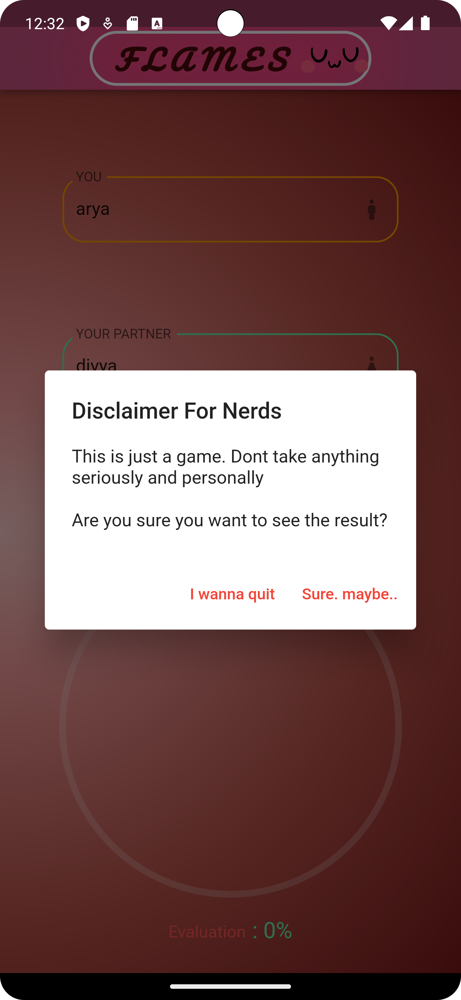
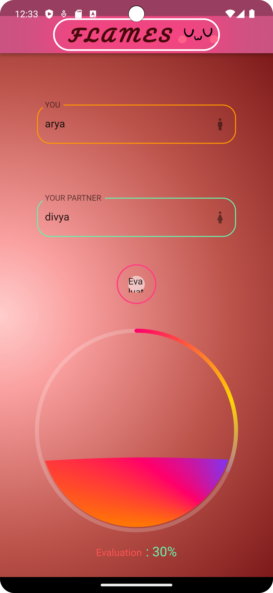

# iiitr_assignment

## THIS REPO CORRECTLY PROVIDES A SOLUTION TO "FLAMES" PROBLEM 
# FLAMES Calculator App

## SOME IMAGES

### Splash Screen


### Disclaimer Screen


### Evaluation Screen


### Result Screen


## Introduction

Welcome to the FLAMES Calculator App repository! This Flutter app allows you to determine the compatibility between two people based on their names using the famous FLAMES algorithm. The FLAMES acronym stands for Friends, Love, Affection, Marriage, Enemy, and Siblings. It's a fun way to predict the future of a relationship.

This repository contains the source code and assets for the FLAMES Calculator app. You can use this code as a reference to understand how to create a simple Flutter application or even modify it to suit your specific needs.

## Features

- Enter the names of two individuals and calculate their FLAMES compatibility.
- Learn about the meanings of the FLAMES result.

## Getting Started

To get started with the FLAMES Calculator App, you need to have Flutter and Dart installed on your system. If you haven't already, follow the official Flutter installation guide at [Flutter.dev](https://flutter.dev/docs/get-started/install).

Once Flutter is installed, you can clone this repository to your local machine using the following command:

```bash
git clone https://github.com/ARYPROGRAMMER/FLAMES.git
```

Then, navigate to the project directory:

```bash
cd FLAMES
```

### Running the App

To run the app on your local development environment, follow these steps:

1. Open a terminal in the project directory.

2. Connect your Android or iOS device to your computer or use an emulator.

3. Run the app using the following command:

   ```bash
   flutter run
   ```

4. The app should launch on your device or emulator.

## Usage

1. Open the FLAMES Calculator App on your device or emulator.

2. Enter the names of two individuals in the provided fields.

3. Press the "Evaluate" button to see the FLAMES result.

4. You'll get a result screen with the FLAMES acronym and its meaning for the given names.

## Contributing

If you would like to contribute to the FLAMES Calculator App, please follow these steps:

1. Fork this repository.

2. Create a new branch for your feature or bug fix:

   ```bash
   git checkout -b feature/your-feature-name
   ```

3. Make your changes and test them thoroughly.

4. Commit your changes:

   ```bash
   git commit -m "Add your commit message here"
   ```

5. Push your changes to your forked repository:

   ```bash
   git push origin feature/your-feature-name
   ```

6. Create a pull request to the original repository.

## License

This project is CURRENTLY NOT LICENSED.

## Acknowledgments

- Thanks to the Flutter team for providing a fantastic framework for building beautiful and functional mobile applications.
- More thanks to PAPERWORKS AND RESOURCES provided by the whole flutter community. Shoutout to you peeps <3

## Contact

If you have any questions or need assistance with this project, feel free to contact me at arya.2023ug1104@iiitranchi.ac.in.

Happy Fluttering and enjoy the FLAMES Calculator App! 🔥❤️
